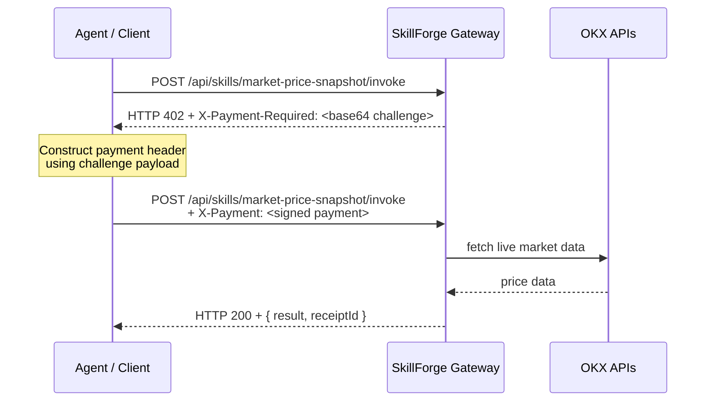

# SkillForge

**On-chain registry and paid execution layer for reusable AI agent skills on X Layer.**

Every agent ecosystem rebuilds the same execution primitives — balance checks, price feeds, swap routing, token risk screening. SkillForge makes those primitives permanent, discoverable, and callable by any agent, with payment gating built into the HTTP layer.

---

## Live

| | |
|---|---|
| **App** | https://web-six-iota-44.vercel.app |
| **Agent discovery endpoint** | https://web-six-iota-44.vercel.app/api/agent |
| **Marketplace API** | https://web-six-iota-44.vercel.app/api/marketplace |
| **Registry contract** | [0x1850d2a31... on OKLink](https://www.oklink.com/xlayer/address/0x1850d2a31CB8669Ba757159B638DE19Af532ba5e#code) |

---

## What It Is

SkillForge is three things working together:

1. **An on-chain registry** — `SkillRegistry.sol` deployed on X Layer mainnet. Creators register callable skills with name, slug, category, price, and creator provenance. Each registration is a permanent on-chain transaction.

2. **A paid invocation gateway** — HTTP endpoints for every registered skill. Calling an endpoint without a payment header returns `HTTP 402` with an x402-compatible challenge. Resubmitting with the payment header returns the result and a receipt ID.

3. **Real execution backed by OKX** — skills call live OKX Onchain OS APIs: DEX price quotes, wallet balance reads, token risk screening, and swap routing. The `safe-swap-execute` skill composes risk scan + route quote + guarded execution in a single call.

---

## System Architecture

```mermaid
flowchart LR
    subgraph Onchain["X Layer Mainnet"]
        R[SkillRegistry.sol]
    end

    subgraph Backend["SkillForge API (Next.js serverless)"]
        M[/api/marketplace]
        I[/api/skills/:slug/invoke]
        A[/api/agent]
        X402[x402 challenge middleware]
    end

    subgraph OKX["OKX Onchain OS"]
        DEX[DEX quote API]
        BAL[Wallet balance API]
        RISK[Token risk API]
        SWAP[Swap execution]
    end

    Creator -->|registerSkill tx| R
    R -->|skill metadata| M
    Agent -->|GET /api/agent| A
    Agent -->|POST invoke| I
    I -->|no payment header| X402
    X402 -->|HTTP 402 + challenge| Agent
    Agent -->|replay + X-Payment header| I
    I --> DEX
    I --> BAL
    I --> RISK
    I --> SWAP
    I -->|result + receiptId| Agent
```

---

## x402 Payment Flow

Skills use an x402-compatible challenge-response flow. No API key needed — payment proof is passed in the HTTP header.



---

## Skill Catalog

| Slug | Category | Price | Backing |
|---|---|---|---|
| `market-price-snapshot` | Market | $0.10 | OKX DEX quote API |
| `wallet-balance-check` | Wallet | $0.08 | OKX wallet balance API |
| `contract-risk-scan` | Security | $0.12 | OKX token risk API |
| `swap-route-quote` | Execution | $0.18 | OKX DEX routing API |
| `safe-swap-execute` | Execution | $0.25 | Composed: risk + quote + guarded swap |
| `token-holder-analysis` | Security | $0.10 | Beta — holder distribution |
| `gas-price-snapshot` | Market | $0.06 | Beta — X Layer gas estimate |
| `liquidity-depth-check` | Execution | $0.12 | Beta — pool depth lookup |

The first five skills are live and registered on-chain. Beta skills are in the catalog with mock execution.

---

## Agent Quick-Start

Any agent can self-discover all available skills, their endpoints, prices, and the full x402 flow in one request.

### 1 — Discover skills

```bash
curl https://web-six-iota-44.vercel.app/api/agent
```

Response includes:
- full skills manifest with slugs, endpoints, categories, prices
- MCP tool definitions with JSON Schema for each skill
- x402 flow instructions
- cURL quickstart per skill

Response headers: `X-MCP-Compatible: true`, `X-Registry: 0x1850d2a31...`, `X-Chain: eip155:196`

### 2 — Invoke a skill (x402 flow)

Step 1 — initial request returns HTTP 402 with payment challenge:

```bash
curl -X POST https://web-six-iota-44.vercel.app/api/skills/market-price-snapshot/invoke \
  -H "Content-Type: application/json" \
  -d '{"amount": "0.01"}'
# → HTTP 402
# → X-Payment-Required: <base64-encoded challenge>
```

Step 2 — resubmit with payment header:

```bash
curl -X POST https://web-six-iota-44.vercel.app/api/skills/market-price-snapshot/invoke \
  -H "Content-Type: application/json" \
  -H "X-Payment: <payment-header>" \
  -d '{"amount": "0.01"}'
# → HTTP 200
# → { ok: true, result: { price, volume, ... }, receiptId: "rcpt_..." }
```

### 3 — Wallet balance check

```bash
curl -X POST https://web-six-iota-44.vercel.app/api/skills/wallet-balance-check/invoke \
  -H "Content-Type: application/json" \
  -H "X-Payment: <payment-header>" \
  -d '{"walletAddress": "0x89740dfdc33b07242d1276ad453e00eb56c25884"}'
```

### 4 — Safe swap (composed skill)

```bash
curl -X POST https://web-six-iota-44.vercel.app/api/skills/safe-swap-execute/invoke \
  -H "Content-Type: application/json" \
  -H "X-Payment: <payment-header>" \
  -d '{"fromToken": "OKB", "toToken": "USDT", "amount": "0.1"}'
# → returns: transactionHash, riskScan result, routeQuote, previousExecution proof
```

---

## Onchain Verification

All activity is verifiable on [OKLink X Layer explorer](https://www.oklink.com/xlayer).

### Registry contract

[`0x1850d2a31CB8669Ba757159B638DE19Af532ba5e`](https://www.oklink.com/xlayer/address/0x1850d2a31CB8669Ba757159B638DE19Af532ba5e#code) — verified source code on OKLink. Ownable, Solidity ^0.8.24.

### Agentic Wallet

[`0x89740dfdc33b07242d1276ad453e00eb56c25884`](https://www.oklink.com/xlayer/address/0x89740dfdc33b07242d1276ad453e00eb56c25884) — holds USDT and OKB on X Layer mainnet. Used for demo identity and execution proof.

### Mainnet swap proof

The Agentic Wallet executed a real OKB → USDT swap via SkillForge:

[`0x0d6da5ea1cc77c0e6943d730d7392e9a99d04ac599ab8d850214f94b4837c2ba`](https://www.oklink.com/xlayer/tx/0x0d6da5ea1cc77c0e6943d730d7392e9a99d04ac599ab8d850214f94b4837c2ba) — 0.118 OKB → 10.10 USDT

### Skill registration transactions

Each of the five live skills was registered on-chain by the deployer wallet `0x94c188F8280cA706949CC030F69e42B5544514ac`:

| Skill | Registration tx |
|---|---|
| `market-price-snapshot` | [0xaf929...](https://www.oklink.com/xlayer/tx/0xaf92994289936f55ed4e3263ae94011cb384b877e250650e9cd99eac5f49bc82) |
| `wallet-balance-check` | [0x6b431...](https://www.oklink.com/xlayer/tx/0x6b4310f5bb668ac6a55a2d191bc405a5d94ff4b21a1d887750348e7469fd9b31) |
| `contract-risk-scan` | [0x6f839...](https://www.oklink.com/xlayer/tx/0x6f839db28c1c18432fe1007d06925084546a693e6f74365f09109372489aa670) |
| `swap-route-quote` | [0x04496...](https://www.oklink.com/xlayer/tx/0x04496049d2aaaf50abc5b63eb19450603ae38821f6e044229d552abf41a98f6c) |
| `safe-swap-execute` | [0xc41c2...](https://www.oklink.com/xlayer/tx/0xc41c216fd80d6fe53807269f8398229cdf7c9d2d631af16046921e7417845bae) |

---

## Frontend

Five pages, all production-grade:

| Page | Path | Description |
|---|---|---|
| Marketplace | `/` | Skill grid with category filters, live activity feed, composability diagram |
| Skill detail | `/skill/[slug]` | Per-skill invoke panel, onchain provenance, cURL example |
| Demo | `/demo` | Full composability demonstration with AutoDemo cascade |
| Publish | `/publish` | Calldata generator — produces ABI-encoded `registerSkill()` call |
| Dashboard | `/dashboard` | Creator view with registration tx provenance per skill |

Design: dark mineral palette, Outfit + JetBrains Mono type stack, asymmetrical layout, animated reveal and composability diagram.

---

## Monorepo Structure

```text
apps/
  web/              Next.js 15 — marketplace frontend + serverless API routes
  api/              Express gateway (local development, CLI-backed skills)
packages/
  contracts/        Hardhat — SkillRegistry.sol, deploy scripts, seed scripts
  shared/           shared TypeScript types, skill catalog, fallback data
```

---

## Local Development

### Prerequisites

- Node.js 20+
- pnpm 9+
- OKX API credentials (for live skill execution)

### Setup

```bash
# clone
git clone https://github.com/Vinaystwt/skillforge
cd skillforge

# install
pnpm install
```

### Environment

Create `apps/web/.env.local`:

```bash
# Network
X_LAYER_RPC=https://rpc.xlayer.tech
X_LAYER_CHAIN_ID=196

# OKX API (required for live skill invocation)
OKX_API_KEY=your_api_key
OKX_SECRET_KEY=your_secret_key
OKX_PASSPHRASE=your_passphrase

# Contract
NEXT_PUBLIC_REGISTRY_ADDRESS=0x1850d2a31CB8669Ba757159B638DE19Af532ba5e

# x402 payment configuration
X402_PAY_TO=0x89740dfdc33b07242d1276ad453e00eb56c25884
X402_NETWORK=eip155:196
X402_ASSET=0x779ded0c9e1022225f8e0630b35a9b54be713736
X402_AMOUNT_USDT=100000

# Local API (optional — for separate Express gateway)
NEXT_PUBLIC_API_BASE_URL=http://localhost:3001
API_PORT=3001
APP_URL=http://localhost:3000
```

### Run

```bash
# frontend only (recommended for most development)
pnpm dev:web
# → http://localhost:3000

# API gateway (optional — for Express-backed skills)
pnpm dev:api
# → http://localhost:3001

# both
pnpm dev:web &
pnpm dev:api
```

### Build

```bash
pnpm build
# runs across all packages in the workspace
```

---

## Contract Operations

```bash
# compile
pnpm --filter @skillforge/contracts build

# test
pnpm --filter @skillforge/contracts test

# deploy to X Layer mainnet
pnpm --filter @skillforge/contracts exec hardhat run scripts/deploy.ts --network xlayer

# seed 5 skills into the deployed registry
pnpm --filter @skillforge/contracts exec hardhat run scripts/seed.ts --network xlayer
```

Requires `PRIVATE_KEY` and `X_LAYER_RPC` set in the root `.env`.

---

## API Reference

All endpoints are available at the same origin as the frontend in the live deployment.

### Discovery

```
GET /api/agent
```

Returns full skills manifest. Headers: `X-MCP-Compatible: true`, `X-Registry`, `X-Chain`.

### Marketplace

```
GET /api/marketplace
GET /api/marketplace/skills
GET /api/marketplace/skills/:slug
```

### Invocation

```
POST /api/skills/:slug/invoke
```

Without `X-Payment` header: returns `HTTP 402` + `X-Payment-Required` challenge.  
With `X-Payment` header: returns skill result + `receiptId`.

---

## Deployment

The app is deployed on Vercel. Environment variables required in Vercel project settings:

```
OKX_API_KEY
OKX_SECRET_KEY
OKX_PASSPHRASE
NEXT_PUBLIC_REGISTRY_ADDRESS
X402_PAY_TO
X402_NETWORK
X402_ASSET
X402_AMOUNT_USDT
X_LAYER_RPC
```

---

## Constraints and Notes

- The x402 payment challenge is a standards-compatible implementation for the invocation surface. Production settlement reconciliation and replay protection can be extended for production deployments.
- `safe-swap-execute` in the public deployment returns the real prior mainnet swap transaction as proof, alongside live risk scan and route quote data. Wallet-signed execution is an operator-controlled path.
- The `apps/api` Express gateway is included for local development and CLI-backed skill paths. In the live Vercel deployment all skill invocations run as Next.js serverless functions.

---

## License

MIT
