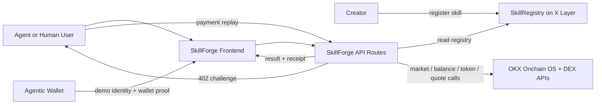

# SkillForge

SkillForge is an on-chain registry and paid execution layer for reusable AI agent skills on X Layer. Creators publish callable capabilities, attach pricing, and expose them as agent-ready endpoints. Consumers discover skills, route through paid invocation flows, and execute real actions backed by OKX Onchain OS capabilities.

## Live Links
- Live app: `https://web-six-iota-44.vercel.app`
- Live API health: `https://web-six-iota-44.vercel.app/api/health`
- Live marketplace API: `https://web-six-iota-44.vercel.app/api/marketplace`
- Verified registry contract: `https://www.oklink.com/xlayer/address/0x1850d2a31CB8669Ba757159B638DE19Af532ba5e#code`

## What It Does
- publishes reusable skills to an on-chain `SkillRegistry` on X Layer
- exposes a backend gateway for discovery and invocation
- wraps live OKX-backed capabilities for market data, wallet checks, token risk screening, quotes, and guarded swaps
- uses an x402-compatible `HTTP 402` challenge flow at the API edge for paid invocation
- ships a polished frontend for human judges with marketplace, creator, and demo flows

## Why This Product
Agent builders keep rebuilding the same execution primitives. SkillForge turns those primitives into an ecosystem layer:
- skills are discoverable
- skills are versioned
- skills have creator provenance
- skills can be rated
- skills can be invoked by humans or agents
- skills can be monetized per call

## Hackathon Fit
- Track: `Skills Arena`
- Network: `X Layer mainnet`
- Core integrations:
  - `Agentic Wallet`
  - `Onchain OS`
  - `OKX DEX / security / wallet tooling`
  - `x402-compatible` payment challenge flow

## Live Onchain Details
- Deployer wallet: `0x94c188F8280cA706949CC030F69e42B5544514ac`
- Agentic Wallet: `0x89740dfdc33b07242d1276ad453e00eb56c25884`
- Registry contract: `0x1850d2a31CB8669Ba757159B638DE19Af532ba5e`
- Contract verification: `OKLink verified`
- Agentic Wallet funding swap tx: `0x0d6da5ea1cc77c0e6943d730d7392e9a99d04ac599ab8d850214f94b4837c2ba`

### Seed skill registration txs
- `market-price-snapshot`: `0xaf92994289936f55ed4e3263ae94011cb384b877e250650e9cd99eac5f49bc82`
- `wallet-balance-check`: `0x6b4310f5bb668ac6a55a2d191bc405a5d94ff4b21a1d887750348e7469fd9b31`
- `contract-risk-scan`: `0x6f839db28c1c18432fe1007d06925084546a693e6f74365f09109372489aa670`
- `swap-route-quote`: `0x04496049d2aaaf50abc5b63eb19450603ae38821f6e044229d552abf41a98f6c`
- `safe-swap-execute`: `0xc41c216fd80d6fe53807269f8398229cdf7c9d2d631af16046921e7417845bae`

## Monorepo Structure
```text
apps/
  web/         Next.js marketplace and demo frontend
  api/         skill gateway, invoke routes, x402 challenge surface
packages/
  contracts/   Hardhat contract package and X Layer deploy scripts
  shared/      shared types, seeded skills, mock fallback data
```

## Architecture Diagram


## Why This Matters For X Layer
SkillForge is not another single-purpose agent. It is the reusable capability layer agents can publish into and consume from. That makes it infrastructure for the X Layer agent economy:
- discoverable skills
- on-chain provenance
- paid invocation
- reusable execution primitives
- clearer distribution for agent builders

## Current Skill Catalog
1. `market-price-snapshot`
2. `wallet-balance-check`
3. `contract-risk-scan`
4. `swap-route-quote`
5. `safe-swap-execute`

## Frontend Experience
The frontend is intentionally not a generic crypto dashboard. It uses:
- an editorial-dark mineral palette
- asymmetrical layout rhythm
- typography contrast between a serif display face and clean body text
- motion-led reveal patterns and live activity surfaces

Pages:
- `/` marketplace
- `/skill/[slug]` skill detail
- `/publish` creator intake
- `/dashboard` creator surface
- `/demo` judge/demo flow

The deployed app includes:
- live marketplace pages
- built-in serverless API routes under `/api/*`
- interactive invoke panels on the skill and demo pages
- x402-compatible payment challenge demo flow

## Backend Surface
### Health
- `GET /health`

### Marketplace
- `GET /marketplace`
- `GET /marketplace/skills`
- `GET /marketplace/skills/:slug`

### Invocation
- `POST /skills/:slug/invoke`

If a paid route is called without a payment header, the API returns:
- `HTTP 402`
- `PAYMENT-REQUIRED` header with an x402-compatible challenge payload

In the live deployment these backend endpoints are served from the same Vercel app:
- `/api/health`
- `/api/marketplace`
- `/api/marketplace/skills`
- `/api/marketplace/skills/:slug`
- `/api/skills/:slug/invoke`

## Environment
Create a local `.env` based on `.env.example`.

Required values:
```bash
PRIVATE_KEY=
X_LAYER_RPC=https://rpc.xlayer.tech
OKX_API_KEY=
OKX_SECRET_KEY=
OKX_PASSPHRASE=
NEXT_PUBLIC_REGISTRY_ADDRESS=
NEXT_PUBLIC_API_BASE_URL=http://localhost:3001
X402_PAY_TO=
X402_NETWORK=eip155:196
X402_ASSET=0x779ded0c9e1022225f8e0630b35a9b54be713736
```

## Local Run
Install:
```bash
pnpm install
```

Build:
```bash
pnpm build
```

Run API:
```bash
pnpm dev:api
```

Run frontend:
```bash
pnpm dev:web
```

## Contract Commands
Compile:
```bash
pnpm --filter @skillforge/contracts build
```

Test:
```bash
pnpm --filter @skillforge/contracts test
```

Deploy to X Layer:
```bash
pnpm --filter @skillforge/contracts exec hardhat run scripts/deploy.ts --network xlayer
```

Seed registry:
```bash
pnpm --filter @skillforge/contracts exec hardhat run scripts/seed.ts --network xlayer
```

## Verification Summary
- workspace build: passing
- contract test suite: passing
- direct API function verification against live registry: passing
- direct OKX-backed quote invocation: passing
- production Vercel health endpoint: passing
- production marketplace endpoint: passing
- production 402 challenge flow: passing
- production paid replay invoke flow: passing
- contract explorer verification: passing

## Known Constraints
- `x402` seller verification is implemented as a challenge-compatible demo payment surface for the hackathon MVP; production-grade settlement reconciliation should still be extended with stronger proof storage and replay controls
- live `safe-swap-execute` returns a guarded execution plan in the public deployment; final wallet-signed trade execution remains an operator-controlled path
- local API port binding could not be validated inside the sandbox, so local runtime verification used direct service execution instead

## Positioning In X Layer Ecosystem
SkillForge is infrastructure, not a one-off workflow demo. It gives X Layer a reusable registry and invocation surface for agent capabilities, which is materially more important for ecosystem growth than a single hardcoded bot path.
